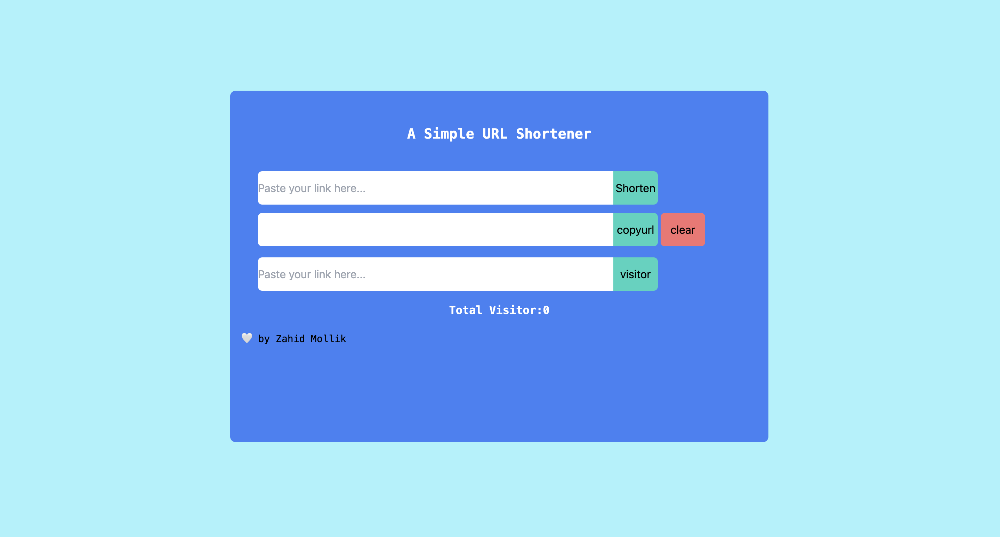

<h1 align="center">A Simple URL Shortener</h1>

<div align="center">

 

 </div>

 ## Project Setup

 - Clone this repo
 
   ```
   https://github.com/ZahidMollik/URL-Shortener.git
   ```
 - Open this folder any Code Editor and create a  `.env` file 
   ```
   PORT=<Your Port Number>
   MONGODB_URL=<Your MONGODB URL>

   ```

 - Run below command in the terminal

    ```
     npm install
     npm run server
     npm run client
    ```


